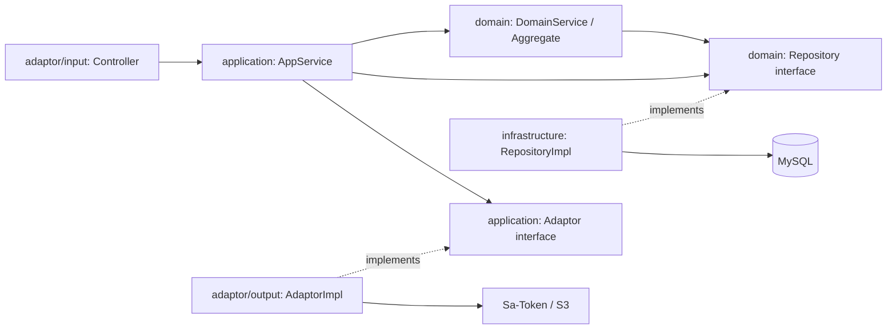

# spring-template

[](https://adoptium.net/)
[](https://spring.io/projects/spring-boot)
[](https://maven.apache.org/)
[](LICENSE)

面向个人项目和单体应用的 **Spring Boot 后端脚手架**。以 DDD 和六边形架构组织代码，提供认证、用户管理、文件存储三个示例模块，以及可直接用于业务开发的分层规范。

采用单 Maven 模块、按包分层的结构，通过完整业务示例展示 Controller、应用服务、领域模型、仓储和外部服务适配器之间的协作。

[快速开始](#快速开始) · [接口说明](#接口说明) · [架构设计](#架构设计) · [开发规范](docs/rule/README.md) · [问题反馈](https://github.com/florianjsun/spring-template/issues)

## 项目特性

- **轻量 DDD**：`adaptor`、`application`、`domain`、`infrastructure` 四层，加上 `common` 共享内核；区分聚合根、实体、值对象与领域服务。
- **认证与会话**：邮箱注册、登录、注销，BCrypt 密码哈希，Sa-Token + Redis 会话管理。
- **用户管理**：查询和修改个人资料、修改密码；管理员可分页查询、查看详情、启用和禁用用户，禁用时踢下线。
- **文件存储**：兼容 S3 / MinIO，支持上传、下载、元数据查询、我的文件分页及删除；MySQL 保存元数据，对象存储保存文件内容。
- **统一接口约定**：`Result<T>` 响应、`PageResult<T>` 分页、业务错误码、全局异常处理与 Jakarta Validation 参数校验。
- **持久化与转换**：MyBatis-Flex、逻辑删除、乐观锁、审计字段；MapStruct 生成 DTO / 领域对象 / PO 转换代码。
- **开发配套**：Swagger UI 在线调试、Maven Wrapper、领域单元测试和分层开发文档。

## 技术栈

以下版本以 [pom.xml](pom.xml) 和 [Maven Wrapper 配置](.mvn/wrapper/maven-wrapper.properties) 为准。

| 组件                        | 版本                     | 用途                             |
|-----------------------------|--------------------------|----------------------------------|
| Java                        | 25                       | 编译与运行                       |
| Spring Boot                 | 4.1.1                    | Web MVC、依赖管理与自动配置      |
| Maven Wrapper               | 3.9.16                   | 统一构建环境                     |
| MyBatis-Flex                | 1.11.8                   | 数据访问、分页、逻辑删除与乐观锁 |
| Sa-Token                    | 1.46.0                   | 登录会话与角色鉴权               |
| SpringDoc OpenAPI           | 3.1.0                    | OpenAPI 文档与 Swagger UI        |
| MapStruct                   | 1.6.3                    | 编译期对象转换                   |
| Hutool                      | 5.8.47                   | BCrypt 等通用工具                |
| AWS SDK for Java            | 2.54.10                  | 同步 S3 客户端                   |
| MySQL / Redis               | 服务端版本由运行环境提供 | 业务数据 / 会话存储              |
| Lombok / Jakarta Validation | 由 Spring Boot 管理      | 简化模型代码 / 参数校验          |

## 快速开始

### 1. 准备环境与代码

准备 JDK 25、Git，以及可访问的 MySQL、Redis 和 S3 兼容对象存储服务。本地对象存储可使用 MinIO。Maven Wrapper 会下载指定版本的
Maven，无需单独安装 Maven，首次构建需要访问 Maven 依赖仓库。

```shell
git clone https://github.com/florianjsun/spring-template.git
cd spring-template
java -version
```

确认 `JAVA_HOME` 指向 JDK 25。默认连接信息如下，配置入口为 [application.yaml](src/main/resources/application.yaml)：

| 服务       | 默认地址 / 名称                               | 默认凭据                    |
|------------|-----------------------------------------------|-----------------------------|
| MySQL      | `localhost:3306`，数据库 `spring_template`    | `root` / `root`             |
| Redis      | `localhost:6379`                              | 未配置密码                  |
| S3 / MinIO | `http://localhost:9000`，桶 `spring-template` | `minioadmin` / `minioadmin` |
| 应用 HTTP  | `http://localhost:8080`                       | 通过登录接口获取 token      |

这些凭据用于本地示例；接入实际环境时通过环境变量覆盖。

### 2. 使用 Skill 改包（可选）

基于模板创建自己的项目时，建议先完成改包，再初始化数据库和存储桶；仅体验模板可跳过此步。

**准备 Skill**

在 Codex 中打开项目根目录，确认存在技能文件
[.agents/skills/rename-spring-template/SKILL.md](.agents/skills/rename-spring-template/SKILL.md)。Codex 会从项目的
`.agents/skills` 目录发现技能，无需安装到全局目录。若未识别，先检查文件位置，再重启 Codex；调用方式也可参考
[Codex 官方 Skills 文档](https://developers.openai.com/codex/skills)。

**发送改包请求**

在 Codex 对话中发送以下提示词，将示例值替换为自己的项目标识。`$rename-spring-template` 是技能调用标记，不是终端命令。

```text
使用 $rename-spring-template 初始化当前项目：
groupId=com.example
artifactId=order-service
basePackage=com.example.order
```

三项参数均需明确提供，Java 根包不会由 Maven 坐标自动推测：

| 参数          | 含义                     | 示例                |
|---------------|--------------------------|---------------------|
| `groupId`     | 项目自身的 Maven groupId | `com.example`       |
| `artifactId`  | Maven artifactId         | `order-service`     |
| `basePackage` | Java 根包                | `com.example.order` |

Skill 会先检查现有改动、名称合法性和目标文件冲突，列出新旧标识映射，再迁移主源码与测试源码，并同步配置、SQL 和项目文档。
上例未单独指定的名称会按以下规则生成：

| 项目项                   | 改包后的值                     |
|--------------------------|--------------------------------|
| Maven name、Spring 应用名 | `order-service`                |
| Maven description        | `order-service 项目`           |
| 启动类                   | `OrderServiceApplication`      |
| 启动测试类               | `OrderServiceApplicationTests` |
| OpenAPI 标题             | `order-service API`            |
| 数据库名                 | `order_service`                |
| S3 / MinIO bucket        | `order-service`                |

如需自定义，可在提示词中追加“数据库名使用 `order_dev`，bucket 使用 `order-service-dev`”。如仅需预览，追加
“仅预览新旧映射和受影响文件，不修改文件”；如仅需改 Java 包，明确限定“仅修改 Java 根包及相关引用和目录，保留其他项目标识”。

**验证并继续启动**

Skill 会通过 clean 构建重新生成 MapStruct 和 MyBatis-Flex 代码，并检查新包路径、启动类和打包产物。以上例为例，排除启动上下文测试的验证命令为：

```powershell
.\mvnw.cmd clean verify '-Dtest=*,!OrderServiceApplicationTests'
```

Linux / macOS 使用 `./mvnw clean verify '-Dtest=*,!OrderServiceApplicationTests'`。测试类名应替换为实际的新名称；外部服务准备完成后，再执行不带测试排除参数的 `clean verify`。

改包只修改仓库内文件，不会创建或重命名真实数据库、存储桶，也不会重命名仓库根目录、修改 Git remote 或自动提交、推送。
继续下方步骤时，执行改包后的 SQL，并按更新后的配置创建数据库和存储桶。后文的默认配置、启动类与 JAR 名称也应以改包后的实际值为准。

### 3. 初始化数据库与存储桶

在项目根目录打开终端，通过 MySQL 客户端连接数据库：

```shell
mysql --default-character-set=utf8mb4 -h 127.0.0.1 -P 3306 -u root -p
```

在 MySQL 客户端中执行：

```sql
SOURCE docs/sql/schema.sql;
```

也可以使用数据库工具执行 [docs/sql/schema.sql](docs/sql/schema.sql)。脚本会创建 `spring_template` 数据库、`t_user` 和
`t_file` 表，并插入初始管理员。应用不会自动执行 `docs/sql` 下的脚本。

在 MinIO 管理界面或通过 S3 管理工具，预先创建名为 `spring-template` 的存储桶，并确保配置中的访问凭据具备该桶的对象读写、删除权限。

### 4. 配置连接信息

默认配置可直接用于上表对应的本地服务。连接其他环境时，在启动应用的终端中设置环境变量，例如：

**Windows PowerShell**

```powershell
$env:SPRING_DATASOURCE_USERNAME = "your-db-user"
$env:SPRING_DATASOURCE_PASSWORD = "your-db-password"
$env:SPRING_DATA_REDIS_HOST = "127.0.0.1"
$env:FILE_STORAGE_S3_ENDPOINT = "http://127.0.0.1:9000"
$env:FILE_STORAGE_S3_ACCESSKEY = "your-access-key"
$env:FILE_STORAGE_S3_SECRETKEY = "your-secret-key"
```

**Linux / macOS**

```bash
export SPRING_DATASOURCE_USERNAME='your-db-user'
export SPRING_DATASOURCE_PASSWORD='your-db-password'
export SPRING_DATA_REDIS_HOST='127.0.0.1'
export FILE_STORAGE_S3_ENDPOINT='http://127.0.0.1:9000'
export FILE_STORAGE_S3_ACCESSKEY='your-access-key'
export FILE_STORAGE_S3_SECRETKEY='your-secret-key'
```

将示例值替换为实际连接信息。完整配置映射见[配置说明](#配置说明)。

### 5. 启动应用

**Windows PowerShell**

```powershell
.\mvnw.cmd spring-boot:run
```

**Linux / macOS**

```bash
./mvnw spring-boot:run
```

也可在 IDE 中导入 `pom.xml`，使用 JDK 25
运行 [SpringTemplateApplication](src/main/java/com/florian/sun/spring/template/SpringTemplateApplication.java)。

启动后访问：

| 入口         | 地址                                                                                       |
|--------------|--------------------------------------------------------------------------------------------|
| Swagger UI   | [http://localhost:8080/swagger-ui/index.html](http://localhost:8080/swagger-ui/index.html) |
| OpenAPI JSON | [http://localhost:8080/v3/api-docs](http://localhost:8080/v3/api-docs)                     |

项目提供后端 API，未包含前端首页；请从 Swagger UI 或接口路径访问。

### 6. 登录并验证接口

初始化 SQL 提供以下管理员账号：

| 邮箱                | 密码          | 角色    |
|---------------------|---------------|---------|
| `admin@example.com` | `Admin123456` | `ADMIN` |

首次使用后通过 `PUT /users/me/password` 修改密码。注册接口创建普通用户，注册成功后需要再调用登录接口。

在另一个 PowerShell 终端执行以下示例，完成登录并查询当前用户资料：

```powershell
$baseUrl = "http://localhost:8080"
$loginBody = @{
    email = "admin@example.com"
    password = "Admin123456"
} | ConvertTo-Json

$login = Invoke-RestMethod -Method Post -Uri "$baseUrl/auth/login" `
    -ContentType "application/json" -Body $loginBody

if ($login.code -ne "0") {
    throw $login.message
}

$sessionHeaders = @{}
$sessionHeaders[$login.data.tokenName] = $login.data.tokenValue
Invoke-RestMethod -Uri "$baseUrl/users/me" -Headers $sessionHeaders
```

在 Swagger UI 中可先调用 `POST /auth/login`，再点击 **Authorize**，填入响应中的 `data.tokenValue`。默认请求头为 `satoken`
，直接填写 token 值，不添加 `Bearer` 前缀。

## 配置说明

Spring Boot 环境变量可覆盖 [application.yaml](src/main/resources/application.yaml) 中的值。下表列出常用配置：

| 配置项                                      | 环境变量                                  | 默认值                                                           |
|---------------------------------------------|-------------------------------------------|------------------------------------------------------------------|
| `server.port`                               | `SERVER_PORT`                             | `8080`，Spring Boot 默认值                                       |
| `spring.datasource.url`                     | `SPRING_DATASOURCE_URL`                   | 本机 MySQL 的 `spring_template` 数据库，完整 JDBC URL 见配置文件 |
| `spring.datasource.username`                | `SPRING_DATASOURCE_USERNAME`              | `root`                                                           |
| `spring.datasource.password`                | `SPRING_DATASOURCE_PASSWORD`              | `root`                                                           |
| `spring.data.redis.host`                    | `SPRING_DATA_REDIS_HOST`                  | `localhost`                                                      |
| `spring.data.redis.port`                    | `SPRING_DATA_REDIS_PORT`                  | `6379`                                                           |
| `spring.data.redis.password`                | `SPRING_DATA_REDIS_PASSWORD`              | 未配置                                                           |
| `file.storage.s3.endpoint`                  | `FILE_STORAGE_S3_ENDPOINT`                | `http://localhost:9000`                                          |
| `file.storage.s3.region`                    | `FILE_STORAGE_S3_REGION`                  | `us-east-1`                                                      |
| `file.storage.s3.access-key`                | `FILE_STORAGE_S3_ACCESSKEY`               | `minioadmin`                                                     |
| `file.storage.s3.secret-key`                | `FILE_STORAGE_S3_SECRETKEY`               | `minioadmin`                                                     |
| `file.storage.s3.bucket`                    | `FILE_STORAGE_S3_BUCKET`                  | `spring-template`                                                |
| `file.storage.s3.path-style-access`         | `FILE_STORAGE_S3_PATHSTYLEACCESS`         | `true`                                                           |
| `spring.servlet.multipart.max-file-size`    | `SPRING_SERVLET_MULTIPART_MAXFILESIZE`    | `20MB`                                                           |
| `spring.servlet.multipart.max-request-size` | `SPRING_SERVLET_MULTIPART_MAXREQUESTSIZE` | `25MB`                                                           |

环境变量名称遵循 Spring Boot 规则：`.` 替换为 `_`、删除 `-`、转为大写，因此 `access-key` 对应 `ACCESSKEY`。

- MinIO 默认使用 path-style 访问；连接 AWS S3 时按实际区域设置 `endpoint`、`region`，并按需将 `path-style-access` 改为
  `false`。
- Sa-Token 默认请求头为 `satoken`，有效期 30 天，允许多端登录，每次登录生成新 token，关闭 Cookie 读取。
- 当前仅提供一份 `application.yaml`。可根据部署需要增加环境配置，敏感信息通过环境变量或部署平台注入。

## 接口说明

除注册、登录及文档等放行路径外，接口均需登录。管理端接口额外要求 `ADMIN` 角色，具体请求字段可在 Swagger UI 查看。

| 模块 | 方法     | 路径                       | 功能                                           | 访问要求   |
|------|----------|----------------------------|------------------------------------------------|------------|
| 认证 | `POST`   | `/auth/register`           | 邮箱注册                                       | 公开       |
| 认证 | `POST`   | `/auth/login`              | 登录并获取 token                               | 公开       |
| 认证 | `POST`   | `/auth/logout`             | 注销当前会话                                   | 已登录     |
| 用户 | `GET`    | `/users/me`                | 我的资料                                       | 已登录     |
| 用户 | `PUT`    | `/users/me/profile`        | 修改昵称、头像                                 | 已登录     |
| 用户 | `PUT`    | `/users/me/password`       | 修改密码                                       | 已登录     |
| 用户 | `GET`    | `/users`                   | 分页查询用户                                   | `ADMIN`    |
| 用户 | `GET`    | `/users/{userId}`          | 用户详情                                       | `ADMIN`    |
| 用户 | `POST`   | `/users/{userId}/disable`  | 禁用用户并踢下线                               | `ADMIN`    |
| 用户 | `POST`   | `/users/{userId}/enable`   | 启用用户                                       | `ADMIN`    |
| 文件 | `POST`   | `/files`                   | 上传文件，`multipart/form-data`，字段名 `file` | 已登录     |
| 文件 | `GET`    | `/files`                   | 分页查询我的文件                               | 已登录     |
| 文件 | `GET`    | `/files/{fileId}`          | 文件元数据                                     | 已登录     |
| 文件 | `GET`    | `/files/{fileId}/download` | 下载文件                                       | 已登录     |
| 文件 | `DELETE` | `/files/{fileId}`          | 删除文件                                       | 文件上传者 |

当前文件查询和下载允许登录用户按 ID 访问任意文件，用于头像等共享读取场景；文件列表仅返回当前用户上传的文件，删除操作校验上传者身份。

### 响应与分页

JSON 接口使用 `Result<T>`。例如，注销成功的响应为：

```json
{
  "code": "0",
  "message": "成功",
  "data": null,
  "success": true
}
```

`code` 是字符串，`"0"` 表示成功。常见错误码包括 `PARAM_ERROR`、`NOT_LOGIN`、`NO_PERMISSION` 和 `CONCURRENT_CONFLICT`
。当前全局异常处理器将捕获的错误转换为响应体，不按业务错误码设置 HTTP 状态；客户端应检查 `code`，不能仅凭 HTTP 200 判断操作成功。

分页入参为 `pageNum`、`pageSize`，默认值分别为 `1`、`10`，每页最多 `200` 条。分页响应的 `data` 包含 `pageNum`、`pageSize`、
`total` 和 `records`。

下载成功时直接返回文件流及 `Content-Disposition` 响应头，不包装为 `Result<T>`。

## 架构设计

项目采用 **单模块、按包分层** 的六边形架构。领域仓储接口定义在 `domain`，外部服务接口定义在 `application`，由外层提供实现。



### 目录结构

```text
spring-template/
|-- docs/
|   |-- rule/                      # DDD 总览与各层开发规范
|   `-- sql/schema.sql             # 数据库结构与初始管理员
|-- src/main/java/com/florian/sun/spring/template/
|   |-- SpringTemplateApplication.java
|   |-- adaptor/                   # HTTP 入口、会话与对象存储适配器、全局异常处理
|   |-- application/               # auth / user / file 场景编排、DTO、Assembler、端口
|   |-- domain/                    # user / file 聚合、实体、值对象、领域服务、仓储接口
|   |-- infrastructure/            # 仓储实现、PO、Mapper、Converter、角色数据源
|   |-- common/                    # 统一响应、分页、异常、错误码与模型基类
|   `-- config/                    # MyBatis-Flex、Sa-Token、OpenAPI、S3 配置
|-- src/main/resources/application.yaml
|-- src/test/java/                 # 领域与公共组件测试、Spring 上下文测试
|-- .mvn/wrapper/                  # Maven Wrapper 配置
|-- mybatis-flex.config            # MyBatis-Flex 注解处理器配置
`-- pom.xml
```

### 开发约定

- Controller 负责协议、鉴权、参数校验和响应封装；业务编排放在 `application`。
- 写操作由应用服务界定事务，实体与聚合根承载业务规则；查询场景由 `QueryAppService` 组织。
- `application` 和 `domain` 通过接口使用仓储及外部能力，不直接依赖外层实现。
- `Assembler` 负责 DTO 与领域对象转换，`Converter` 负责持久化对象转换，`Mapper` 命名用于 MyBatis-Flex 数据访问接口。
- 聚合根持有实体和值对象；属性、`id` 和 `version` 由实体承载。持久化表统一包含版本、逻辑删除和审计字段。

完整约束与示例见以下文档：

| 文档                                                    | 内容                                       |
|---------------------------------------------------------|--------------------------------------------|
| [规范索引](docs/rule/README.md)                         | 阅读入口、技术栈映射、与 easy-DDD 的差异   |
| [DDD 架构总览](docs/rule/DDD.md)                        | 依赖规则、包结构、四种开发模式与选择决策树 |
| [共享内核规范](docs/rule/ddd-common-layer.md)           | 统一响应、异常、基类和通用工具             |
| [领域层规范](docs/rule/ddd-domain-layer.md)             | 聚合根、实体、值对象、领域服务和仓储接口   |
| [应用层规范](docs/rule/ddd-application-layer.md)        | 场景编排、事务、DTO、Assembler 和端口      |
| [适配器层规范](docs/rule/ddd-adaptor-layer.md)          | Controller、鉴权、外部调用和异常处理       |
| [基础设施层规范](docs/rule/ddd-infrastructure-layer.md) | Repository、PO、Mapper 和 Converter        |

## 构建与测试

以下命令在项目根目录执行。Windows PowerShell 使用 `.\mvnw.cmd`，Linux / macOS 将其替换为 `./mvnw`。

```powershell
# 编译，包括生成 MapStruct 实现和 MyBatis-Flex TableDef
.\mvnw.cmd compile

# 运行不加载 Spring 上下文的领域与公共组件测试
.\mvnw.cmd '-Dtest=*,!SpringTemplateApplicationTests' test

# 运行全部测试，包括 Spring 上下文加载测试
.\mvnw.cmd test

# 执行测试并打包
.\mvnw.cmd clean package

# 运行构建产物
java -jar target/spring-template-0.0.1.jar
```

`SpringTemplateApplicationTests` 使用真实应用配置加载 Spring 上下文，未提供隔离测试配置或
Testcontainers。完整启动和接口联调应先完成数据库、Redis 及对象存储准备；上下文测试通过不代表外部服务读写链路已验证。

IDE 中应启用注解处理，并将项目 SDK 和 Maven 运行 JDK 设为 25。自动生成的代码位于 `target/generated-sources/annotations`
，由构建生成，无需手写。

## 基于模板开发

首次初始化可先按照[使用 Skill 改包](#2-使用-skill-改包可选)完成项目标识迁移，再按以下步骤核对和扩展业务。

1. 按实际项目修改 Maven 坐标、Java 根包及目录、启动类和测试类名称。
2. 同步应用名称、OpenAPI 标题与版本、数据库名和 S3 存储桶名称；数据库和存储桶需在对应环境中创建。
3. 阅读 [DDD 架构总览](docs/rule/DDD.md)，选择写、读、纯计算或规则加计算模式，以现有 `user`、`file` 模块作为实现参考。
4. 在各层添加对应业务包，补充数据库变更、业务错误码、接口文档及领域测试。
5. 根据实际业务调整注册入口、角色规则、文件访问策略及环境配置，并更新 README 中的项目标识和启动说明。

## 常见问题

| 现象                                    | 排查方向                                                                       |
|-----------------------------------------|--------------------------------------------------------------------------------|
| 编译提示不支持 Java 25                  | 执行 `.\mvnw.cmd -v`，确认 Maven 实际使用 JDK 25，检查 `JAVA_HOME` 和 IDE 配置 |
| 找不到数据库或表                        | 确认已执行 `docs/sql/schema.sql`，且 JDBC URL 指向相同数据库                   |
| 登录时发生 Redis 连接错误               | 检查 Redis 地址、端口、密码及应用到 Redis 的网络连通性                         |
| 上传或下载返回 `EXTERNAL_SERVICE_ERROR` | 查看服务端日志，核对 S3 endpoint、访问凭据、桶名与桶权限                       |
| 下载返回 `FILE_CONTENT_NOT_FOUND`       | 数据库元数据存在，但对应对象已从存储桶中丢失                                   |
| 接口返回 `NOT_LOGIN` / `NO_PERMISSION`  | 检查 `satoken` 请求头和有效期；管理端接口需要 `ADMIN` 角色                     |
| 上传提示超出大小限制                    | 默认单文件上限 `20MB`、请求总量上限 `25MB`，按需调整 multipart 配置            |
| IDE 提示缺少转换实现或 TableDef         | 启用注解处理并执行 `compile`，刷新 Maven 项目及生成源码目录                    |

## 参与贡献

欢迎通过 [Issues](https://github.com/florianjsun/spring-template/issues)
提交问题和建议，或通过 [Pull Requests](https://github.com/florianjsun/spring-template/pulls) 提交改进。问题描述请附复现步骤、JDK
版本和已脱敏的日志；代码变更请遵循现有分层规范，补充与改动相关的测试，并同步接口与配置文档。

## 参考项目

- [Spring PetClinic](https://github.com/spring-projects/spring-petclinic)：参考其本地运行、数据库准备和 IDE 使用说明的组织方式。
- [COLA](https://github.com/alibaba/COLA)：参考其架构介绍、模块职责与快速开始的呈现方式。
- [MyBatis-Plus](https://github.com/baomidou/mybatis-plus)：参考其项目概览、特性列表与文档导航的编排方式；本项目实际使用
  MyBatis-Flex。
- [easy-DDD](https://github.com/alizhangsan602-bit/easy-DDD)：本项目 DDD
  规范的参考来源，具体取舍见[规范索引](docs/rule/README.md)。

## 许可证

本项目采用 [MIT 许可证](LICENSE)，允许使用、修改、分发及商用，使用时须保留版权声明和许可证文本。
