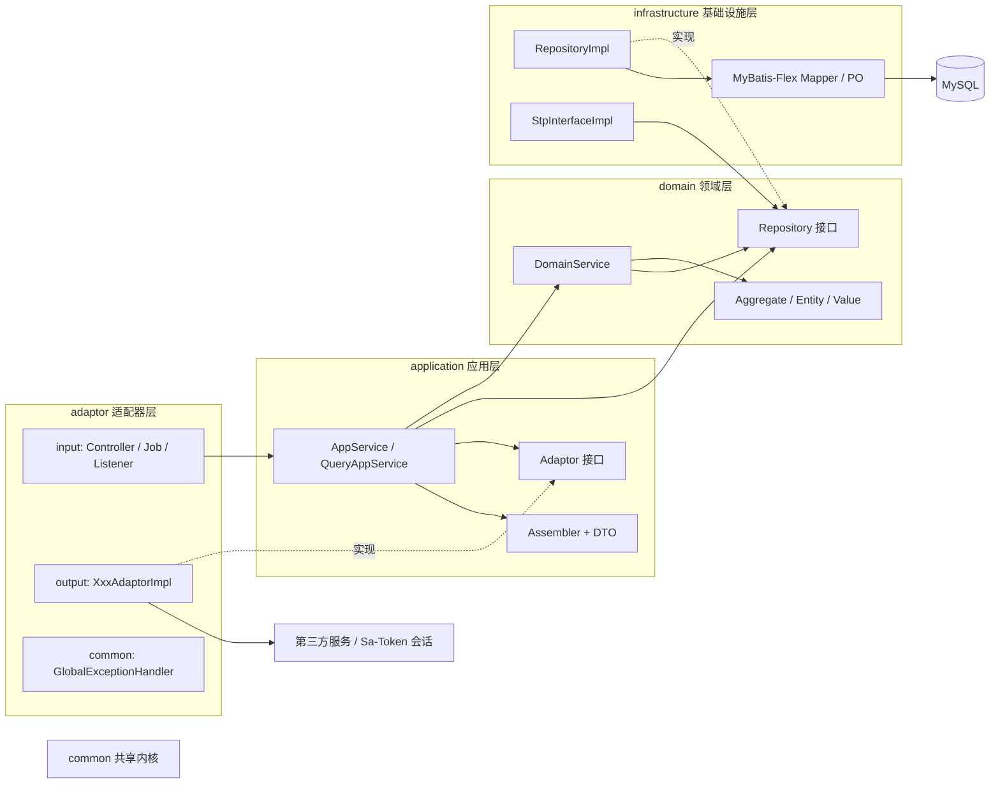

# DDD 架构总览

本规范面向 **个人项目 / 单体 Spring Boot 应用**，由 [easy-DDD](https://github.com/alizhangsan602-bit/easy-DDD)
精简而来。技术栈：Spring Boot 4、Java 25、MyBatis-Flex、Sa-Token、MapStruct、Jakarta Validation、MySQL、Redis。

## 一、六边形架构核心设计原则



### 1.1 分层与依赖关系

**调用顺序**（自外向内）：

```plain
input adaptor → application → domain → Repository 接口（由 infrastructure 实现，操作 MySQL / Redis）
                            → Adaptor 接口（由 output adaptor 实现，调用第三方 / Sa-Token 会话）
```

> **注意**：Repository 不依赖 Adaptor。Repository 处理 **本领域**的数据库、缓存操作；Adaptor 处理 **非本领域**的外部服务调用（第三方
> HTTP、Sa-Token 会话签发等），由 Application 层调用。

**依赖规则**（通过依赖倒置实现解耦）：

| 层               | 可依赖                   | 禁止依赖                    | 说明                                                                                   |
|------------------|--------------------------|-----------------------------|----------------------------------------------------------------------------------------|
| `adaptor`        | `application`、`common`  | `domain`、`infrastructure`  | input 只调用 AppService；output 实现 application 定义的 Adaptor 接口                   |
| `application`    | `domain`、`common`       | `infrastructure`、`adaptor` | 通过 Repository 接口、Adaptor 接口间接使用外层实现                                     |
| `domain`         | `common`                 | 其余所有层                  | 纯业务代码                                                                             |
| `infrastructure` | `domain`、`common`       | `application`、`adaptor`    | 实现 Repository 接口                                                                   |
| `common`         | 无业务层依赖             | 所有业务层                  | 只能依赖 JDK、Lombok、Jackson / Jakarta Validation / `@EnumValue` 注解、无状态静态工具 |
| `config`         | 任意层（仅做 Bean 装配） | —                           | 不允许出现业务逻辑                                                                     |

**关键点**：所有业务层最终依赖领域层，技术细节（MyBatis-Flex、Sa-Token、HTTP Client）只出现在 `infrastructure`、`adaptor`、
`config`。

### 1.2 领域层的隔离性

- `domain` 仅包含纯业务代码， **禁止**引用 MyBatis-Flex、Sa-Token、MapStruct、Jakarta Validation、Spring Web 等技术框架
- 例外：Spring 的 `@Service` / `@Component` 注解、Lombok、JDK、`common` 包内的无状态静态工具，以及领域枚举上的 MyBatis-Flex
  `@EnumValue` 注解（仅此一个，用于省掉 Converter 里的枚举互转）
- 技术实现（数据库、鉴权、第三方 API）通过接口抽象，由 `infrastructure`、`adaptor` 提供实现

### 1.3 异常驱动的错误处理

与 easy-DDD 全链路返回 `ResultDO` 不同，本规范采用 **异常驱动**：

| 位置                                       | 做法                                                                                                                |
|--------------------------------------------|---------------------------------------------------------------------------------------------------------------------|
| domain（聚合根、实体、DomainService）      | 校验失败直接抛 `BizException(ErrorCode)`，不捕获                                                                    |
| application（AppService）                  | 编排失败抛 `BizException`；不 try/catch 领域异常；命令方法加 `@Transactional(rollbackFor = Exception.class)`        |
| infrastructure（RepositoryImpl）           | 乐观锁冲突等技术异常翻译为 `BizException(CommonErrorCode.CONCURRENT_CONFLICT)`；其他 SQL 异常放行，由全局处理器兜底 |
| adaptor/output（AdaptorImpl）              | 第三方调用失败翻译为 `BizException`，禁止泄漏第三方异常类型                                                         |
| adaptor/common（`GlobalExceptionHandler`） | `@RestControllerAdvice` 将 `BizException`、参数校验异常、Sa-Token 异常、未知异常统一转成 `Result<T>`                |

**收益**：AppService 方法内任何一层抛出异常都会触发事务回滚；代码里没有层层 `if (!result.isSuccess())` 的样板。

### 1.4 术语约定

| 术语                       | 含义                                                                     | 所在层                                    |
|----------------------------|--------------------------------------------------------------------------|-------------------------------------------|
| Aggregate / Entity / Value | 聚合根 / 实体 / 值对象                                                   | domain                                    |
| Param / Query / Result     | 领域方法入参 / 仓储查询条件 / 领域计算返回                               | domain                                    |
| RequestDTO / ResponseDTO   | 对外接口的入参 / 出参                                                    | application                               |
| Repository                 | 本领域持久化接口                                                         | 接口在 domain，实现在 infrastructure      |
| Adaptor                    | 外部服务接口                                                             | 接口在 application，实现在 adaptor/output |
| Assembler                  | DTO ↔ Param / Aggregate 转换（MapStruct）                                | application                               |
| Converter                  | PO ↔ Aggregate 转换（MapStruct）；第三方响应 ↔ DTO 转换                  | infrastructure / adaptor                  |
| Mapper                     | **仅指** MyBatis-Flex 数据访问接口 `XxxMapper extends BaseMapper<XxxPO>` | infrastructure                            |
| PO                         | 与数据库表一一对应的持久化对象                                           | infrastructure                            |

> MapStruct 的注解名也叫 `@Mapper`，但 MapStruct 类 **一律以 `Converter` / `Assembler` 结尾**，类名禁止以 `Mapper` 结尾，避免与
> MyBatis-Flex Mapper 混淆。

## 二、工程结构

单模块、按包分层。根包 `com.florian.sun.spring.template`，业务子包 `{业务名}` 使用小写名词（如 `order`、`user`、`auth`）。

```plain
com.florian.sun.spring.template
├── SpringTemplateApplication.java
├── config/                          # Spring 配置类（技术装配，不含业务）
│   ├── SaTokenConfig                # Sa-Token 拦截器注册、路由放行
│   ├── MyBatisFlexConfig            # @MapperScan、全局配置
│   └── OpenApiConfig                # SpringDoc 文档与鉴权头
├── common/                          # 共享内核（替代 easy-DDD 的 model 层）
│   ├── result/                      # Result<T>、PageResult<T>
│   ├── exception/                   # ErrorCode、CommonErrorCode、BizException、BizAssert
│   ├── enums/                       # BaseEnum 及跨领域共享枚举
│   ├── model/                       # BaseAggregate、BaseEntity、PageQuery
│   ├── validation/                  # 校验分组 ValidGroup
│   └── util/                        # 无 IO 静态工具
├── domain/                          # 领域层
│   └── {业务名}/
│       ├── model/
│       │   ├── aggregate/           # 聚合根 {名词}Aggregate
│       │   ├── entity/              # 实体 {名词}Entity
│       │   ├── value/               # 值对象 {名词}Value（record）
│       │   ├── param/               # {方法名}Param、{方法名}Query
│       │   ├── result/              # {方法名}Result
│       │   ├── enums/               # 领域枚举、{业务名}ErrorCode
│       │   └── event/               # 领域事件（record，可选）
│       ├── service/                 # 领域服务 {聚合根名}DomainService
│       └── repository/              # 仓储接口 {聚合根名}Repository
├── application/                     # 应用层
│   └── {业务名}/
│       ├── scenario/                # {聚合根名}AppService、{聚合根名}QueryAppService、{动词}QueryAppService
│       ├── assembler/               # MapStruct Assembler
│       ├── dto/
│       │   ├── req/                 # {方法名}RequestDTO
│       │   ├── res/                 # {方法名}ResponseDTO
│       │   └── model/               # 被多个 DTO 复用的 {概念}DTO
│       └── adaptor/                 # Adaptor 接口及其专用 DTO（application 定义，adaptor/output 实现）
├── infrastructure/                  # 基础设施层
│   ├── common/po/                   # BasePO（主键、审计、逻辑删除、乐观锁）
│   ├── auth/                        # StpInterfaceImpl（Sa-Token 权限数据源）
│   └── {业务名}/
│       ├── repository/              # {聚合根名}RepositoryImpl
│       ├── mysql/
│       │   ├── po/                  # {表名}PO extends BasePO
│       │   │   └── table/           # APT 生成的 {表名}TableDef（不手写）
│       │   └── mapper/              # {表名}Mapper extends BaseMapper<{表名}PO>
│       ├── converter/               # MapStruct Converter（PO ↔ 聚合根）
│       └── cache/                   # Redis 缓存实现（可选）
└── adaptor/                         # 适配器层（防腐层）
    ├── common/                      # GlobalExceptionHandler、通用切面
    └── {业务名}/
        ├── input/                   # {业务名}Controller、{业务名}Job、{业务名}EventListener
        └── output/                  # {Xxx}AdaptorImpl、第三方 client、converter
```

## 三、四种 DDD 开发模式

### 3.1 模式对比表

| 模式              | 聚合根/实体        | 业务逻辑位置     | 状态修改 | 事务                        | 典型场景                         |
|-------------------|--------------------|------------------|----------|-----------------------------|----------------------------------|
| **写模式**        | 有                 | 聚合根/实体方法  | 是       | AppService `@Transactional` | 创建订单、取消订单、修改用户资料 |
| **读模式**        | 有（作为数据载体） | 无（仅数据转换） | 否       | 无（或 `readOnly = true`）  | 订单详情、分页列表               |
| **规则+计算模式** | 有                 | 聚合根/实体方法  | 否       | 无                          | 优惠券规则匹配与计算             |
| **纯计算模式**    | 无                 | DomainService    | 否       | 无                          | 运费试算、报表汇总               |

### 3.2 模式选择决策树

```plain
业务场景分析
    │
    ├── 是否需要修改数据状态？
    │   ├── 是 → 写模式
    │   │   特征：有聚合根/实体，业务逻辑在聚合根方法中，方法会修改实体属性
    │   │
    │   └── 否 → 继续判断
    │       │
    │       ├── 是否有业务逻辑需要处理？
    │       │   ├── 否 → 读模式
    │       │   │   特征：纯查询，聚合根仅作为数据载体，无业务逻辑
    │       │   │
    │       │   └── 是 → 继续判断
    │       │       │
    │       │       ├── 业务逻辑是否基于可配置的规则？
    │       │       │   ├── 是 → 规则+计算模式
    │       │       │   │   特征：规则建模为聚合根，通过聚合根方法匹配和计算，不修改状态
    │       │       │   │
    │       │       │   └── 否 → 纯计算模式
    │       │       │       特征：无聚合根，业务逻辑在DomainService中，基于输入参数计算
```

### 3.3 各模式的调用链

**写模式调用链：**

```plain
Controller → AppService(@Transactional) → DomainService → Aggregate方法 → Repository.save
```

**读模式调用链（查询本领域数据）：**

```plain
Controller → QueryAppService → Repository.findXxx / pageXxx → 聚合根 → Assembler → ResponseDTO
```

**读模式调用链（查询外部数据）：**

```plain
Controller → QueryAppService → Adaptor → 第三方 DTO → 直接返回或简单裁剪
```

**纯计算模式调用链：**

```plain
Controller → {动词}QueryAppService → DomainService → 计算并返回Result → Assembler → ResponseDTO
```

**规则+计算模式调用链：**

```plain
Controller → {动词}QueryAppService → DomainService → Repository 加载规则聚合根
                                                   → 聚合根.matchRule / calculate → Result
```

## 四、规范文件组合使用指南

`ddd-common-layer.md` 定义所有层共用的基类与配置，任何模式都先读它。

### 4.1 写模式开发

1. [`ddd-common-layer.md`](ddd-common-layer.md) → `Result`、`BizException`、`BaseAggregate`
2. [`ddd-domain-layer.md`](ddd-domain-layer.md) → 基础规范 + 写模式 domain 规范
3. [`ddd-application-layer.md`](ddd-application-layer.md) → 基础规范 + 写模式 application 规范
4. [`ddd-adaptor-layer.md`](ddd-adaptor-layer.md) → 基础规范 + 写模式 adaptor 规范
5. [`ddd-infrastructure-layer.md`](ddd-infrastructure-layer.md) → 基础规范 + 写模式 infrastructure 规范

### 4.2 读模式开发

1. [`ddd-common-layer.md`](ddd-common-layer.md) → `PageQuery`、`PageResult`
2. [`ddd-domain-layer.md`](ddd-domain-layer.md) → 基础规范 + 读模式 domain 规范
3. [`ddd-application-layer.md`](ddd-application-layer.md) → 基础规范 + 读模式 application 规范
4. [`ddd-adaptor-layer.md`](ddd-adaptor-layer.md) → 基础规范 + 读模式 adaptor 规范
5. [`ddd-infrastructure-layer.md`](ddd-infrastructure-layer.md) → 基础规范 + 读模式 infrastructure 规范

### 4.3 纯计算模式开发

1. [`ddd-common-layer.md`](ddd-common-layer.md)
2. [`ddd-domain-layer.md`](ddd-domain-layer.md) → 基础规范 + 纯计算模式 domain 规范
3. [`ddd-application-layer.md`](ddd-application-layer.md) → 基础规范 + 纯计算模式 application 规范
4. [`ddd-adaptor-layer.md`](ddd-adaptor-layer.md) → 基础规范 + 纯计算模式 adaptor 规范

> **注意**：纯计算模式不需要 Infrastructure 层，业务逻辑完全由 DomainService 承载，无聚合根和实体，不涉及数据持久化。

### 4.4 规则+计算模式开发

1. [`ddd-common-layer.md`](ddd-common-layer.md)
2. [`ddd-domain-layer.md`](ddd-domain-layer.md) → 基础规范 + 规则+计算模式 domain 规范
3. [`ddd-application-layer.md`](ddd-application-layer.md) → 基础规范 + 规则+计算模式 application 规范
4. [`ddd-adaptor-layer.md`](ddd-adaptor-layer.md) → 基础规范
5. [`ddd-infrastructure-layer.md`](ddd-infrastructure-layer.md) → 基础规范 + 规则+计算模式 infrastructure 规范

## 五、技术栈在各层的落位

| 技术                                                               | 允许出现的层                                                                          | 禁止出现的层                                                      |
|--------------------------------------------------------------------|---------------------------------------------------------------------------------------|-------------------------------------------------------------------|
| MyBatis-Flex（`@Table`、`BaseMapper`、`QueryWrapper`、`TableDef`） | `infrastructure`、`config`                                                            | `domain`（仅允许枚举上的 `@EnumValue`）、`application`、`adaptor` |
| Sa-Token `StpUtil`、`@SaCheckLogin`、`@SaCheckPermission`          | `adaptor/input`、`config`                                                             | `domain`、`application`、`infrastructure`                         |
| Sa-Token `StpInterface` 实现                                       | `infrastructure/auth`                                                                 | 其他                                                              |
| Sa-Token 会话签发（`StpUtil.login`）                               | `adaptor/{auth}/output`（实现 application 的 `SessionAdaptor`）                       | 其他                                                              |
| MapStruct                                                          | `application/assembler`、`infrastructure/converter`、`adaptor/output/converter`       | `domain`                                                          |
| Jakarta Validation 注解                                            | `application/dto`（声明）、`common/model/PageQuery`、`adaptor/input`（`@Valid` 触发） | `domain`（领域校验用代码 + `BizException`）                       |
| Spring Web（`@RestController`、`RestClient`）                      | `adaptor`                                                                             | 其他                                                              |
| `@Transactional`                                                   | `application/scenario`                                                                | `domain`、`infrastructure`                                        |
| Redis（`StringRedisTemplate`）                                     | `infrastructure/cache`、Sa-Token 内部                                                 | `domain`、`application`                                           |
| SpringDoc 注解（`@Tag`、`@Operation`、`@Schema`）                  | `adaptor/input`、`application/dto`                                                    | 其他                                                              |

| 规范                     | 地址                                                       |
|--------------------------|------------------------------------------------------------|
| ddd-common-layer         | [ddd-common-layer.md](ddd-common-layer.md)                 |
| ddd-domain-layer         | [ddd-domain-layer.md](ddd-domain-layer.md)                 |
| ddd-application-layer    | [ddd-application-layer.md](ddd-application-layer.md)       |
| ddd-adaptor-layer        | [ddd-adaptor-layer.md](ddd-adaptor-layer.md)               |
| ddd-infrastructure-layer | [ddd-infrastructure-layer.md](ddd-infrastructure-layer.md) |
